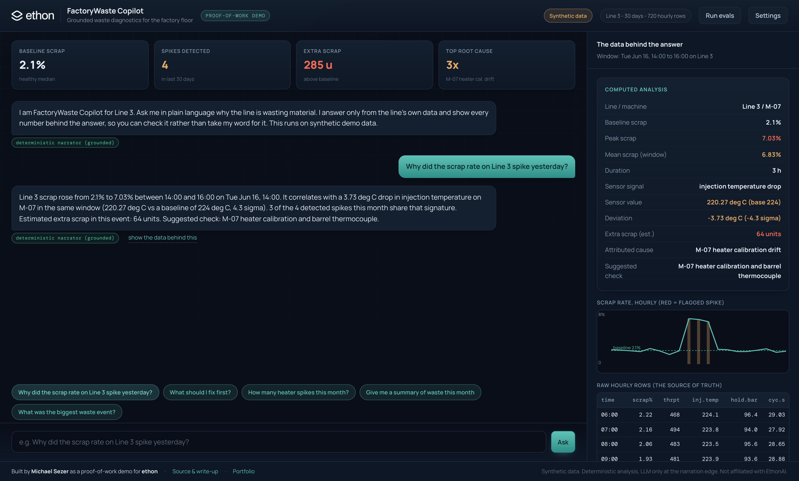
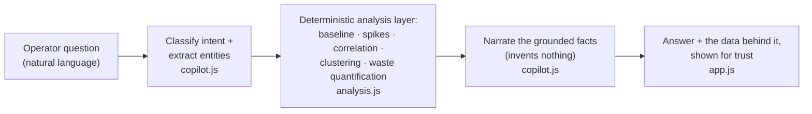

<div align="center">



# FactoryWaste Copilot

**Ask a production line, in plain language, why it is wasting material. Get a grounded answer traced to the line's own data.**

[](https://msstrategies.github.io/factorywaste-copilot/)
[](#proves-it-is-grounded)
[](#files)
[](LICENSE)

[**Try the live demo**](https://msstrategies.github.io/factorywaste-copilot/) · [Technical write-up](WRITEUP.md) · [Author's portfolio](https://msstrategies.github.io)

</div>

---

> **Operator:** "Why did the scrap rate on Line 3 spike yesterday?"
>
> **Copilot:** "Line 3 scrap rose from 2.1% to 7.0% between 14:00 and 16:00 on Tue Jun 16. It correlates with a 3.7 deg C drop in injection temperature on M-07 in the same window (4.3 sigma). 3 of the 4 detected spikes this month share that signature. Suggested check: M-07 heater calibration and barrel thermocouple."

Every number the Copilot states is computed by a deterministic, auditable analysis layer. The language model is used only to phrase that result. It cannot invent a figure.

## Built for ethon

ethon (EthonAI) builds Industrial AI to eliminate waste in manufacturing for customers like Siemens, Bosch, Lindt and Roche. The hard part is not the model. It is running state-of-the-art AI in messy real-world settings and getting the people on the factory floor to trust and adopt it.

So instead of sending a resume and waiting, I built a small working slice of exactly that problem and present it the way a Forward Deployed Engineer would on day one: deterministic data work, an LLM only at the explanation layer, and a tool built for the operator on the floor rather than a data scientist.

This is synthetic data and a weekend of work, not a product, and it does not use any ethon or customer data (I could not have that, and saying so is the honest move). It is how I think about deterministic, trustworthy AI on a factory floor. I would genuinely like feedback on where it is wrong.

## What it does

1. **Ingests production data.** A synthetic but realistic dataset: one injection-molding line, 30 days, hourly rows with throughput, scrap rate, and three sensor readings (injection temperature, hold pressure, cycle time) across three machines. Four waste events are deliberately injected, each with a detectable signature.

2. **Analyses it deterministically.** A plain-rules engine (no black-box model) builds a robust baseline, flags scrap spikes, groups them, correlates each spike against sensor deviations to attribute a likely root cause, clusters spikes by shared signature ("3 of the last 4 spikes share this"), and quantifies the waste in extra scrapped units.

3. **Surfaces prioritized recommendations.** Root causes are ranked by recurrence and total waste, so the operator sees the single highest-leverage fix first (one calibration job that removes a repeat offender).

4. **Answers questions in plain language.** The chat layer classifies the question, pulls the matching grounded facts from the analysis layer, and narrates them. A "show the data behind this" panel displays the computed analysis, a scrap-rate chart, and the raw hourly rows, so the operator can verify every figure instead of trusting the model.

5. <a id="proves-it-is-grounded"></a>**Proves it is grounded.** A 10-case eval suite asserts on the structured facts the narrator is allowed to speak from. Green means the Copilot cannot state a wrong number. Run it in the UI ("Run evals") or headless (`npm run eval`).

## How it works



The deterministic layer is the contract. The LLM is downstream of it and is handed the facts with a hard instruction to narrate only those numbers. Swap the language model and the answers stay correct, because correctness lives in the data layer, not the model.

### Files

| File | Role |
|------|------|
| `data.js` | Synthetic 30-day dataset, deterministic seed, 4 injected events |
| `analysis.js` | Deterministic waste engine: baseline, spikes, correlation, ranking |
| `copilot.js` | Intent classifier + grounded narrator (mock default, Claude optional) |
| `evals.js` | 10 grounding eval cases asserting on structured facts |
| `index.html` / `styles.css` / `app.js` | The operator-facing chat UI and trust panel |
| `run-evals.mjs` | Headless eval runner (`npm run eval`) |
| `serve.mjs` | Zero-dependency static server (`npm start`), optional |

Zero third-party runtime dependencies. Standard library only. Nothing to vet, no supply-chain surface.

## Run it

**Just open it** (fully offline, no install): double-click `index.html`. The app runs entirely in the browser with the deterministic narrator. No key, no server, no network.

**Local server** (cleaner URL for a screen-share):

```bash
npm start          # serves at http://localhost:5173
```

**Run the eval suite:**

```bash
npm run eval       # 10/10 grounded eval cases passed
```

**Optional - route narration through Claude:** open **Settings** in the app, tick "Use Claude API", and paste an Anthropic key. The key is held in memory only and never written to disk. Whether mock or LLM, the narrator is constrained to the numbers the analysis layer produced. The key is never hardcoded; see `.env.example` for the variable name used by a server-side deployment variant.

## Design decisions an FDE would defend

- **Deterministic core, LLM at the edge.** Trust on a factory floor comes from reproducibility. The numbers are computed by rules an engineer can read, not inferred by a model. The model only translates.
- **Groundedness is testable.** The eval suite asserts on facts, not prose, so it survives rewording and proves the system is honest.
- **Specificity over magic.** The correlation logic isolates the M-06 pressure event from the M-07 temperature events. It does not blame one machine for everything. Specificity is what earns operator trust.
- **Built for the operator.** The "show the data behind this" panel exists so the person on the floor can verify, not just believe. Adoption is the real product.
- **Honest about scope.** Synthetic data, clearly labelled. A wedge, not a platform.

## What this is not

It is not a product, not a finished system, and not trained on or connected to any real factory or ethon data. It is a focused weekend build that demonstrates how I think about deterministic, trustworthy AI for manufacturing, and a concrete starting point to discuss the real problem.

## License & author

MIT, see [`LICENSE`](LICENSE). Built by **Michael Sezer** as a proof-of-work demo. Not affiliated with EthonAI.
[Portfolio](https://msstrategies.github.io) · [GitHub](https://github.com/msstrategies)
